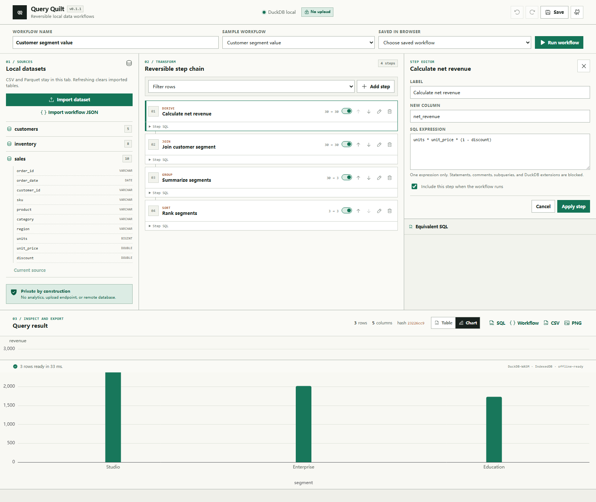
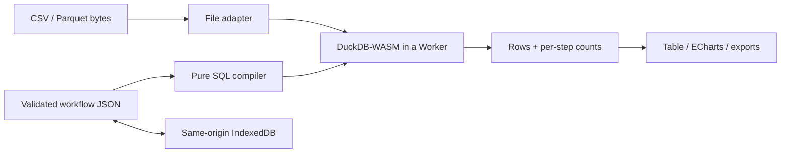

# Query Quilt

[简体中文](README.zh-CN.md)

[](https://github.com/KanadeK/query-quilt/actions/workflows/ci.yml)
[](https://github.com/KanadeK/query-quilt/actions/workflows/security.yml)
[](https://github.com/KanadeK/query-quilt/releases/latest)
[](LICENSE)

**Query Quilt turns local CSV and Parquet files into a reversible chain of data steps.**
Each edit runs in DuckDB-WASM, shows equivalent SQL and measured row flow, and can be
undone without uploading the source data.



- Build filter, select, derive, group, join, and sort steps without hiding the SQL.
- Verify every step through input/output counts and deterministic result hashes.
- Export executable SQL, workflow JSON, complete result CSV, and a chart PNG.

```bash
git clone https://github.com/KanadeK/query-quilt.git
cd query-quilt
npm ci
npm run dev
```

Current release: **v0.1.1**. Requires Node.js 22 or newer for local development.

### A real input → output

The bundled 30-row [`sales.csv`](examples/data/sales.csv) flows through derive
`30 → 30`, filter `30 → 9`, group `9 → 3`, and sort `3 → 3` steps:

| category    | revenue | order_count |
| ----------- | ------: | ----------: |
| Home        | 1132.02 |           5 |
| Electronics |  423.00 |           2 |
| Accessories |  409.36 |           2 |

Run the same production UI and DuckDB-WASM path yourself:

```bash
npm run demo
```

The command prints the generated SQL, step telemetry, full 64-character result hash, and
rows, then writes `artifacts/demo/northern-revenue-by-category.json`.

> **Privacy boundary:** imported bytes and queries stay in the current browser tab.
> Workflow definitions can be saved to same-origin IndexedDB. Query Quilt has no upload,
> account, telemetry, advertising, or remote database service. Hosting still serves the
> application assets on first load; explicit downloads are the only application outputs.

## What works in v0.1.1

- Local `.csv` and `.parquet` import with filename normalization, empty-file checks,
  Parquet magic validation, and a 512 MiB per-file guard.
- Six validated step kinds: filter, select, derived column, group/aggregate, inner or left
  join, and multi-column sort.
- Real DuckDB-WASM execution using the repository-bundled MVP worker and WASM module.
- Per-step equivalent SQL, input/output row counts, full-query SQL, execution duration,
  and SHA-256 result hash.
- Editable, enableable, reorderable, and removable steps with toolbar and keyboard
  undo/redo (`Ctrl/Cmd+Z`, `Ctrl/Cmd+Shift+Z`, or `Ctrl/Cmd+Y`).
- Local workflow save/load through IndexedDB; source file contents are not stored in the
  workflow document.
- Result table, numeric bar chart, and SQL/workflow/CSV/PNG exports.
- Five deterministic workflows over three synthetic, MIT-licensed tables.
- Installable PWA shell; all bundled samples continue to execute after the network is
  disconnected once the production application has been cached.
- Responsive 390 px layout, keyboard-operable controls, semantic labels, and an automated
  serious/critical Axe check.

## Non-goals

v0.1.1 is intentionally a focused browser workbench. It is not:

- a hosted warehouse, collaborative notebook, user account system, or cloud sync service;
- a general SQL IDE with arbitrary statement execution or extension installation;
- a streaming engine or a promise that every 512 MiB file will fit every device's memory;
- a stable npm library, public JavaScript API, or data-processing CLI.

## How it works



The domain core under `src/core` has no React, DOM, storage, or DuckDB dependency. It
validates a workflow with Zod and deterministically compiles enabled steps into named CTEs.
Adapters under `src/adapters` own file, Arrow, DuckDB, and IndexedDB boundaries. The React
workbench under `src/features` orchestrates these pieces; it does not define workflow
meaning.

See [Architecture](docs/ARCHITECTURE.md) for the invariants, execution sequence, and
extension points.

## Interface guide

1. **Sources** — choose a bundled table or import a local CSV/Parquet file. Imports live
   only in the tab's DuckDB instance and disappear on refresh.
2. **Transform** — add, edit, toggle, reorder, or delete steps. Expand “Step SQL” to inspect
   the exact fragment and compare the measured row flow.
3. **Inspector** — edit the selected step or open the complete equivalent SQL.
4. **Inspect and export** — switch between table and chart, inspect the result hash, and
   download SQL, workflow JSON, complete CSV, or PNG.

The UI is the supported product interface. Repository automation is exposed through npm
and Make tasks:

| Task                    | Purpose                                                        |
| ----------------------- | -------------------------------------------------------------- |
| `npm run dev`           | Start the Vite development server.                             |
| `npm run verify`        | Lint, format-check, typecheck, cover, and build.               |
| `npm run test:e2e`      | Build and run eight production-browser acceptance tests.       |
| `npm run demo`          | Execute the bundled example and write a human-readable result. |
| `npm run screenshot`    | Rebuild and capture the real README screenshot.                |
| `npm run benchmark`     | Measure cold start and all five workflows in Chromium.         |
| `npm run package`       | Build and verify versioned release archives and checksums.     |
| `npm run release-check` | Run the complete clean-tree release gate.                      |
| `make verify/demo/...`  | Cross-platform entry points equivalent to the npm tasks.       |

There is no public runtime API guarantee in v0.1.1. The TypeScript modules are organized
for testing and future extraction, but consumers should treat them as internal.

## Complete example

[`regional-category-sales.json`](examples/workflows/regional-category-sales.json) is the
workflow behind the table above. Its compiled SQL is:

```sql
WITH
  "step_1" AS (
    SELECT *, (units * unit_price * (1 - discount)) AS "net_revenue"
    FROM "sales"
  ),
  "step_2" AS (
    SELECT *
    FROM "step_1"
    WHERE "region" = 'North'
  ),
  "step_3" AS (
    SELECT "category",
           SUM("net_revenue") AS "revenue",
           COUNT(*) AS "order_count"
    FROM "step_2"
    GROUP BY "category"
  ),
  "step_4" AS (
    SELECT *
    FROM "step_3"
    ORDER BY "revenue" DESC
  )
SELECT * FROM "step_4";
```

The visible result and this exported SQL are executed by the same DuckDB engine. The E2E
suite also verifies that undo/redo restores the exact 64-character result hash.

## Bundled sample data

All records are synthetic and described in [`examples/README.md`](examples/README.md).

| Table           | Rows | Demonstrates                                  |
| --------------- | ---: | --------------------------------------------- |
| `sales.csv`     |   30 | dates, regions, prices, discounts, categories |
| `inventory.csv` |   10 | stock, reorder levels, suppliers              |
| `customers.csv` |   10 | segments, countries, signup dates             |

The five workflows cover regional revenue, customer segment value, inventory reorder,
product performance, and high-value order review. They make no network calls and are
included in the service-worker cache.

## Install, test, and build

```bash
npm ci
npm run lint
npm run format:check
npm run typecheck
npm run test:coverage
npm run test:e2e
npm run build
npm run package
```

The v0.1.1 baseline contains **58 unit/integration tests** across 12 files and **8 Chromium
E2E tests**. Core coverage is **97.75% statements, 94.11% branches, 100% functions, and
97.68% lines**. Browser paths cover real imports, all four exports, editing, undo/redo,
IndexedDB reload, invalid inputs, chart lifecycle, offline execution, external-request
absence, Axe, and a 390 px viewport.

Equivalent task entry points:

```bash
make verify
make demo
make package
make release-check
```

Windows environments without `make` can run the matching npm commands. See the measured
[benchmark](docs/BENCHMARK.md) and the executable
[release checklist](docs/RELEASE_CHECKLIST.md).

## Privacy and security

Query Quilt makes the local-first boundary testable:

- the application has no application API endpoint or analytics dependency;
- E2E tests fail if the production application makes a non-local request;
- workflow JSON is schema-validated and derived expressions reject statement separators,
  comments, data-changing/extension keywords, and subqueries;
- CSV exports prefix spreadsheet-formula-looking cells to reduce formula injection risk;
- release automation scans tracked content for likely secrets and unfinished markers.

A workflow from an untrusted source is still code-like input. Inspect its displayed SQL
before running it. Browser extensions, a compromised hosting origin, or a compromised
dependency remain outside the application's isolation boundary. Read
[Privacy and security](docs/PRIVACY_AND_SECURITY.md) and report vulnerabilities according
to [SECURITY.md](SECURITY.md).

## Differentiation

A dated GitHub sample of ten relevant public repositories found no active exact
name/slug match and no sampled project estimated above 70% overlap with the complete MVP
contract. This is not a global uniqueness claim.

Query Quilt is narrower than general SQL workbenches: the primary artifact is an ordered,
reversible workflow document; every step exposes both equivalent SQL and measured row
flow; exported SQL must reproduce the visible DuckDB result; and undo/redo is checked
against deterministic hashes. See the evidence and limitations in
[the competitor scan](docs/COMPETITOR_SCAN.md).

## Roadmap

- **v0.1.x:** production feedback, large-file diagnostics, bundle/startup optimization,
  and more accessible chart descriptions.
- **v0.2:** optional OPFS-backed file persistence, richer join editing, and workflow
  migration metadata.
- **Later, only with an explicit privacy design:** shareable encrypted artifacts or a
  reusable core package. No remote upload is implied.

## Contributing

Read [CONTRIBUTING.md](CONTRIBUTING.md), keep domain meaning in `src/core`, and add a
regression test for every fixed defect. Bug and feature Issue Forms plus the pull-request
template are included. The project uses the [Contributor Covenant](CODE_OF_CONDUCT.md).

## FAQ

**Does Query Quilt upload my CSV or Parquet file?**

No. The current application has no upload endpoint. The bytes are registered with the
in-tab DuckDB-WASM instance.

**Why is the first visit relatively large?**

The bundled DuckDB MVP WASM module is about 39 MiB before transfer compression. The
service worker caches production assets for later offline sample use.

**Where are saved workflows?**

Same-origin IndexedDB. Only workflow metadata and transformations are saved, not the
source file bytes. Clearing site data removes them.

**How large a file can I import?**

The application rejects files above 512 MiB, but the practical limit can be much lower on
memory-constrained browsers because v0.1.1 is in-memory.

**Can a workflow execute arbitrary SQL?**

No general SQL editor is exposed. Derived-column expressions are deliberately restricted,
but untrusted workflows should still be inspected before execution.

**Why does the result table stop at 250 rows?**

That display limit keeps the DOM responsive. CSV export includes every result row.

## License

Query Quilt and its synthetic examples are released under the [MIT License](LICENSE).
