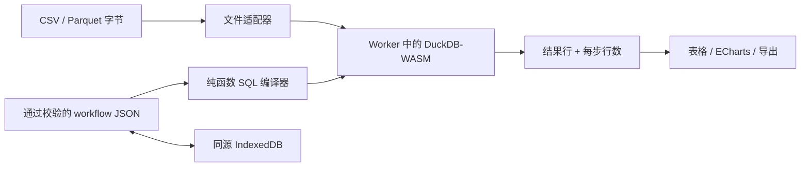

# Query Quilt

[English](README.md)

[](https://github.com/KanadeK/query-quilt/actions/workflows/ci.yml)
[](https://github.com/KanadeK/query-quilt/actions/workflows/security.yml)
[](https://github.com/KanadeK/query-quilt/releases/latest)
[](LICENSE)

**Query Quilt 把本地 CSV 和 Parquet 文件编排成一条可逆的数据步骤链。** 每次编辑都由
DuckDB-WASM 真实执行，并显示等价 SQL 和实际行数变化；源数据无需上传，所有更改均可撤销。


- 支持筛选、选择、派生列、分组、连接和排序，同时不隐藏 SQL。
- 用每步输入/输出行数和确定性结果哈希验证执行结果。
- 导出可执行 SQL、workflow JSON、完整结果 CSV 和图表 PNG。

```bash
git clone https://github.com/KanadeK/query-quilt.git
cd query-quilt
npm ci
npm run dev
```

当前版本：**v0.1.1**。本地开发需要 Node.js 22 或更新版本。

### 一个真实的输入 → 输出

仓库中的 30 行 [`sales.csv`](examples/data/sales.csv) 依次经过派生
`30 → 30`、筛选 `30 → 9`、分组 `9 → 3` 和排序 `3 → 3`：

| category    | revenue | order_count |
| ----------- | ------: | ----------: |
| Home        | 1132.02 |           5 |
| Electronics |  423.00 |           2 |
| Accessories |  409.36 |           2 |

可以通过同一套生产 UI 和 DuckDB-WASM 路径复现：

```bash
npm run demo
```

该命令会输出生成的 SQL、逐步行数、完整 64 位结果哈希和结果行，并写入
`artifacts/demo/northern-revenue-by-category.json`。

> **隐私边界：**导入的字节和查询留在当前浏览器标签页中。工作流定义可以保存到同源
> IndexedDB。Query Quilt 没有上传、账户、遥测、广告或远程数据库服务。首次访问仍需从托管
> 站点加载应用资源；只有用户明确触发的下载才是应用输出。

## v0.1.1 已实现功能

- 本地导入 `.csv` 和 `.parquet`，包含文件名规范化、空文件检查、Parquet magic 校验和
  512 MiB 单文件上限。
- 六种经过 Zod 校验的步骤：筛选、选择、派生列、分组/聚合、inner/left 连接、多列排序。
- 使用仓库随附的 MVP Worker 与 WASM 模块真实执行 DuckDB-WASM 查询。
- 显示每步等价 SQL、输入/输出行数、完整 SQL、执行耗时和 SHA-256 结果哈希。
- 步骤可编辑、启停、重排和删除；支持工具栏以及键盘撤销/重做
  （`Ctrl/Cmd+Z`、`Ctrl/Cmd+Shift+Z`、`Ctrl/Cmd+Y`）。
- 通过 IndexedDB 保存/加载本地工作流；工作流文档不包含源文件内容。
- 结果表、数值柱状图，以及 SQL/workflow/CSV/PNG 四种导出。
- 三张 MIT 许可的合成表和五个确定性工作流。
- 可安装的 PWA 外壳；生产应用完成缓存后，断网仍能执行全部内置样例。
- 390 px 响应式布局、键盘可操作控件、语义化标签和自动化 Axe 严重问题检查。

## 非目标

v0.1.1 是一个聚焦的浏览器工作台，它不是：

- 托管数据仓库、协作笔记本、用户账户系统或云同步服务；
- 可执行任意语句或安装扩展的通用 SQL IDE；
- 流处理引擎，也不承诺每台设备都能在内存中处理 512 MiB 文件；
- 稳定 npm 库、公开 JavaScript API 或数据处理 CLI。

## 工作原理



`src/core` 下的领域核心不依赖 React、DOM、存储或 DuckDB。它使用 Zod 验证工作流，并把
启用的步骤确定性地编译成命名 CTE。`src/adapters` 负责文件、Arrow、DuckDB 和 IndexedDB
边界；`src/features` 下的 React 工作台负责编排，不定义工作流语义。

更完整的不变量、执行顺序和扩展点见[架构文档](docs/ARCHITECTURE.md)。

## 界面说明

1. **Sources**：选择内置表，或导入本地 CSV/Parquet。导入内容只存在于标签页的 DuckDB
   实例中，刷新后清除。
2. **Transform**：新增、编辑、启停、移动或删除步骤；展开 “Step SQL” 可检查精确片段和
   实测行数流。
3. **Inspector**：编辑所选步骤，或查看完整等价 SQL。
4. **Inspect and export**：切换表格/图表、检查结果哈希，并下载 SQL、workflow JSON、完整
   CSV 或 PNG。

UI 是产品支持的使用界面。仓库自动化通过 npm 和 Make 任务提供：

| 任务                    | 作用                                     |
| ----------------------- | ---------------------------------------- |
| `npm run dev`           | 启动 Vite 开发服务器。                   |
| `npm run verify`        | lint、格式、类型、覆盖率和构建验证。     |
| `npm run test:e2e`      | 构建并运行 8 条生产浏览器验收路径。      |
| `npm run demo`          | 执行内置样例并写出可人工检查的真实结果。 |
| `npm run screenshot`    | 重建并截取 README 中的真实界面图。       |
| `npm run benchmark`     | 在 Chromium 中测量冷启动和五个工作流。   |
| `npm run package`       | 构建并验证带版本号的发布包及校验和。     |
| `npm run release-check` | 运行完整的干净工作区发布门禁。           |
| `make verify/demo/...`  | 与 npm 任务等价的跨平台入口。            |

v0.1.1 不承诺公开运行时 API。TypeScript 模块为测试和后续拆包而组织，但外部消费者应把它们
视为内部实现。

## 完整示例

上述结果来自
[`regional-category-sales.json`](examples/workflows/regional-category-sales.json)，其编译 SQL：

```sql
WITH
  "step_1" AS (
    SELECT *, (units * unit_price * (1 - discount)) AS "net_revenue"
    FROM "sales"
  ),
  "step_2" AS (
    SELECT *
    FROM "step_1"
    WHERE "region" = 'North'
  ),
  "step_3" AS (
    SELECT "category",
           SUM("net_revenue") AS "revenue",
           COUNT(*) AS "order_count"
    FROM "step_2"
    GROUP BY "category"
  ),
  "step_4" AS (
    SELECT *
    FROM "step_3"
    ORDER BY "revenue" DESC
  )
SELECT * FROM "step_4";
```

界面结果和导出的 SQL 由同一个 DuckDB 引擎执行。E2E 还会验证撤销/重做后恢复完整的 64 位
结果哈希。

## 内置样例数据

全部记录都是合成数据，详见 [`examples/README.md`](examples/README.md)。

| 表              | 行数 | 覆盖内容                     |
| --------------- | ---: | ---------------------------- |
| `sales.csv`     |   30 | 日期、地区、价格、折扣、类别 |
| `inventory.csv` |   10 | 库存、补货阈值、供应商       |
| `customers.csv` |   10 | 分群、国家、注册日期         |

五个工作流覆盖区域营收、客户分群价值、库存补货、产品表现和高价值订单复核。它们不访问网络，
并被纳入 Service Worker 缓存。

## 安装、测试与构建

```bash
npm ci
npm run lint
npm run format:check
npm run typecheck
npm run test:coverage
npm run test:e2e
npm run build
npm run package
```

v0.1.1 基线包含 **12 个文件中的 58 项单元/集成测试**和 **8 项 Chromium E2E 测试**。
核心覆盖率为：**语句 97.75%、分支 94.11%、函数 100%、行 97.68%**。浏览器路径覆盖真实
导入、四种导出、编辑、撤销/重做、IndexedDB 重载、无效输入、图表生命周期、断网执行、
无外部请求、Axe 和 390 px 视口。

等价任务入口：

```bash
make verify
make demo
make package
make release-check
```

Windows 没有 `make` 时直接运行对应 npm 命令。实测数据见[性能基准](docs/BENCHMARK.md)，
发布门禁见[发布检查表](docs/RELEASE_CHECKLIST.md)。

## 隐私与安全

Query Quilt 把 local-first 边界做成了可测试的约束：

- 应用没有业务 API 端点或分析统计依赖；
- 如果生产应用发起非本地请求，E2E 测试会失败；
- workflow JSON 必须通过 schema 校验；派生表达式拒绝语句分隔符、注释、数据修改/扩展
  关键字和子查询；
- CSV 导出会处理疑似电子表格公式的单元格，降低公式注入风险；
- 发布自动化扫描已跟踪内容中的疑似 secret 和未完成标记。

来自不可信来源的工作流仍应视为类似代码的输入，运行前应检查界面显示的 SQL。浏览器扩展、
被攻陷的托管源或依赖不在应用的隔离边界内。详见[隐私与安全](docs/PRIVACY_AND_SECURITY.md)，
漏洞报告方式见 [SECURITY.md](SECURITY.md)。

## 差异化

在特定日期对十个相关 GitHub 公开仓库的抽样检索中，没有发现活跃的精确同名/同 slug
项目，也没有抽样项目被评估为与完整 MVP 合同重叠超过 70%。这不是“全球唯一”声明。

与通用 SQL 工作台相比，Query Quilt 的核心产物是有序、可逆的工作流文档；每一步同时暴露
等价 SQL 和实测行数；导出 SQL 必须在 DuckDB 中复现可见结果；撤销/重做通过确定性哈希
验收。证据、判断方法和局限见[竞品抽样报告](docs/COMPETITOR_SCAN.md)。

## 路线图

- **v0.1.x：**处理生产反馈、大文件诊断、包体/启动优化和更完整的无障碍图表说明。
- **v0.2：**可选 OPFS 文件持久化、更丰富的连接编辑和工作流迁移元数据。
- **更远期（需要明确隐私设计）：**可分享的加密制品或可复用核心包；不默认引入远程上传。

## 贡献

请阅读 [CONTRIBUTING.md](CONTRIBUTING.md)，把领域语义放在 `src/core`，并为每个缺陷修复
添加回归测试。仓库包含 bug/feature Issue Forms 和 PR 模板，并采用
[Contributor Covenant](CODE_OF_CONDUCT.md)。

## 常见问题

**Query Quilt 会上传我的 CSV 或 Parquet 吗？**

不会。当前应用没有上传端点，文件字节只注册到当前标签页的 DuckDB-WASM 实例。

**为什么首次访问资源较大？**

随包提供的 DuckDB MVP WASM 模块传输压缩前约 39 MiB。Service Worker 会缓存生产资源，
供后续离线执行样例。

**保存的工作流在哪里？**

同源 IndexedDB。只保存工作流元数据和转换，不保存源文件字节；清除站点数据会一并删除。

**能导入多大的文件？**

应用会拒绝超过 512 MiB 的文件；但 v0.1.1 使用内存执行，受限设备的实际可用上限可能低很多。

**工作流能执行任意 SQL 吗？**

不能。产品没有通用 SQL 编辑器，派生列表达式也受到限制；不可信工作流仍应在运行前检查。

**为什么结果表最多显示 250 行？**

这是为了保持 DOM 响应速度；CSV 导出包含全部结果行。

## 许可证

Query Quilt 及其合成样例使用 [MIT License](LICENSE) 开源。
