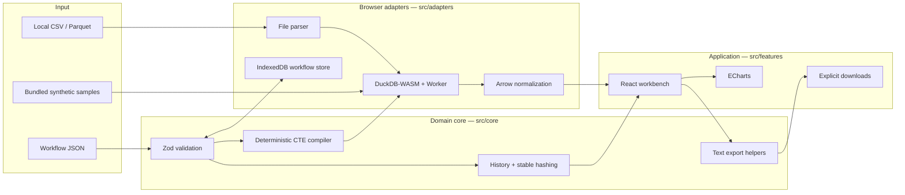

# Architecture

Query Quilt separates deterministic workflow meaning from browser infrastructure. The
boundary exists so workflow validation, SQL generation, history, hashing, and exports can
be tested without React, a DOM, a network, or a database process.

## System map

DuckDB's packaged browser worker performs database work off the main thread. Query Quilt
does not need an additional project-owned worker entry point in v0.1.0.

## Directory responsibilities

| Directory           | Owns                                                                    | Must not own                                        |
| ------------------- | ----------------------------------------------------------------------- | --------------------------------------------------- |
| `src/core`          | workflow schema, SQL compiler, history, stable hash, serialization      | React, DOM, IndexedDB, network, DuckDB              |
| `src/adapters`      | local files, DuckDB-WASM, Arrow values, query execution, IndexedDB      | visual state or product copy                        |
| `src/features`      | workbench state, user actions, editors, table and chart presentation    | alternative workflow semantics                      |
| `examples`          | deterministic MIT-licensed CSV and workflow fixtures                    | external or personal data                           |
| `tests/unit`        | pure rules and adapter boundary behavior                                | browser-only assertions                             |
| `tests/integration` | real DuckDB-WASM query and IndexedDB behavior                           | mocked success in place of a real integration       |
| `tests/e2e`         | production-build user paths, downloads, offline, accessibility, privacy | implementation-specific unit assertions             |
| `scripts`           | reproducible verification, demo, screenshot, benchmark, package gates   | fake success output                                 |
| `.github/workflows` | hosted copies of the same local gates                                   | weakened or `continue-on-error` acceptance criteria |

## Workflow document

A workflow is version-independent JSON with:

- an ID, display name, source table, and ISO timestamps;
- up to 100 uniquely identified steps;
- one of six discriminated step types: `filter`, `select`, `derive`, `group`, `join`, or
  `sort`;
- an explicit `enabled` bit per step.

`WorkflowSchema` is the only entry point for untrusted workflow JSON. Identifiers,
operators, aggregation shapes, array bounds, timestamps, and derived expressions are
validated before compilation or storage. The v0.1.0 document does not embed source file
bytes.

## Compilation invariants

`compileWorkflow` is a pure function:

1. Parse and copy the validated document.
2. Ignore disabled steps without renumbering or mutating the document.
3. Start from the quoted source-table identifier.
4. Compile each enabled step to a named CTE (`step_1`, `step_2`, …).
5. Emit a complete result query plus input- and output-count queries for each step.

All user-controlled identifiers are quoted. Scalar filter values use SQL literals with
single-quote escaping. The same complete SQL shown and downloaded by the UI is the query
executed for the visible result.

## Execution sequence

1. `DuckDbEngine` creates an in-browser database from local DuckDB MVP assets and opens one
   connection.
2. The sample registrar or file adapter registers data, creates a table through
   `read_csv_auto` or `read_parquet`, then drops the temporary virtual file.
3. `executeWorkflow` compiles the document.
4. Each step's input/output count query runs against the same connection. Identical count
   SQL is memoized for that execution.
5. The complete query runs and returns an Arrow table.
6. The Arrow adapter normalizes rows for the UI. Big integers and exact decimals remain
   lossless strings when JavaScript numbers cannot preserve them.
7. A stable serializer and Web Crypto SHA-256 produce the result hash.

DuckDB is therefore the source of truth for both rows and telemetry; neither the UI nor a
test fixture fabricates counts.

## State and reversibility

The workbench stores immutable workflow snapshots as `{ past, present, future }`. A valid
edit pushes the previous document to `past` and clears `future`; undo and redo move the
same parsed documents between the three lists. After each change, the current document is
recompiled and rerun. Browser acceptance tests verify that a redo restores the exact
64-character result hash observed before undo.

`updatedAt` is presentation/persistence metadata and is excluded from the UI's sample
identity comparison. Result hashes cover ordered normalized rows; workflow JSON itself is
serialized deterministically for exports and comparisons.

## Persistence and offline behavior

- Imported file data lives in the in-memory DuckDB instance and is cleared by refresh.
- Saved workflow documents live in a versioned same-origin IndexedDB object store.
- The Vite PWA build precaches the HTML, JavaScript, CSS, worker, DuckDB WASM, manifest, and
  bundled sample assets.
- Once a production origin has completed that cache, all five bundled workflows can run
  after the browser context goes offline.

The 39 MiB DuckDB WASM module makes first load materially larger than a typical static
site. That cost and the in-memory file model are documented rather than hidden.

## Failure handling

Adapter errors remain explicit user-visible errors:

- empty, unsupported, oversized, or invalid-Parquet files are rejected before database
  registration;
- malformed workflow JSON fails Zod validation and does not replace the current result;
- denied clipboard access directs the user to the SQL download;
- DuckDB initialization or query failures enter the React error boundary/status channel;
- export controls requiring a result remain disabled until execution succeeds.

The browser suite covers invalid import branches and asserts that an existing successful
result remains intact.

## Extension rules

- Add a step kind first to the Zod union and pure compiler, with failure-first unit tests.
- Add an external format behind a narrow adapter interface; do not import it into
  `src/core`.
- Add persistence migrations by increasing the IndexedDB version and preserving parse
  validation.
- Any remote adapter would require an explicit product/privacy decision, deterministic
  tests, documentation, and an opt-in UI. v0.1.0 contains no such adapter.
- Keep the visible SQL, exported SQL, and executed SQL on one compiler path.

## Verification map

| Contract                                      | Evidence                                                       |
| --------------------------------------------- | -------------------------------------------------------------- |
| Schema and SQL escaping                       | `tests/unit/workflow-schema.test.ts`, `sql-compiler.test.ts`   |
| Undo/redo and deterministic hashing           | `tests/unit/history.test.ts`, browser workflow tests           |
| Exact Arrow values and real DuckDB execution  | `tests/unit/arrow.test.ts`, `tests/integration/duckdb.test.ts` |
| File and persistence boundaries               | file unit tests and IndexedDB integration/E2E tests            |
| Visible result equals exported compiler path  | compiler/integration tests plus SQL and CSV E2E downloads      |
| All samples work offline                      | `tests/e2e/offline-accessibility.spec.ts`                      |
| No unexpected production network destinations | browser request probes in E2E, demo, screenshot, and benchmark |
